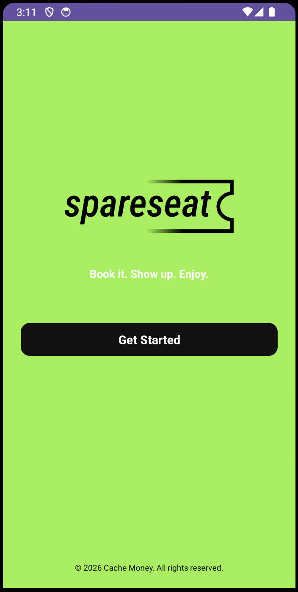
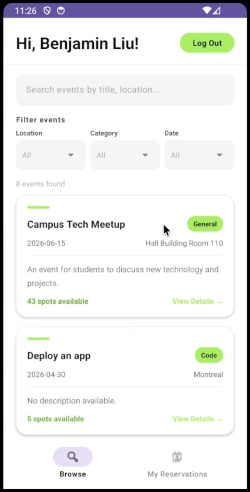
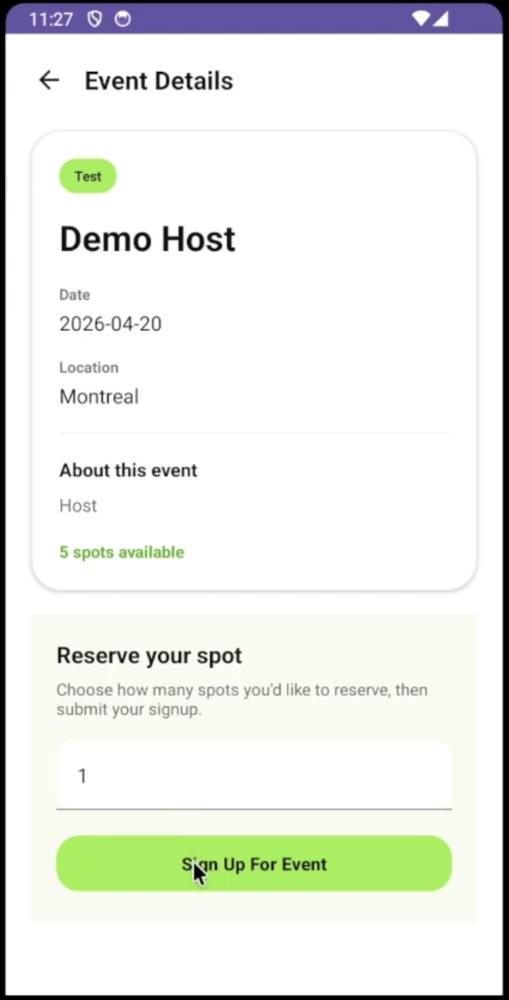
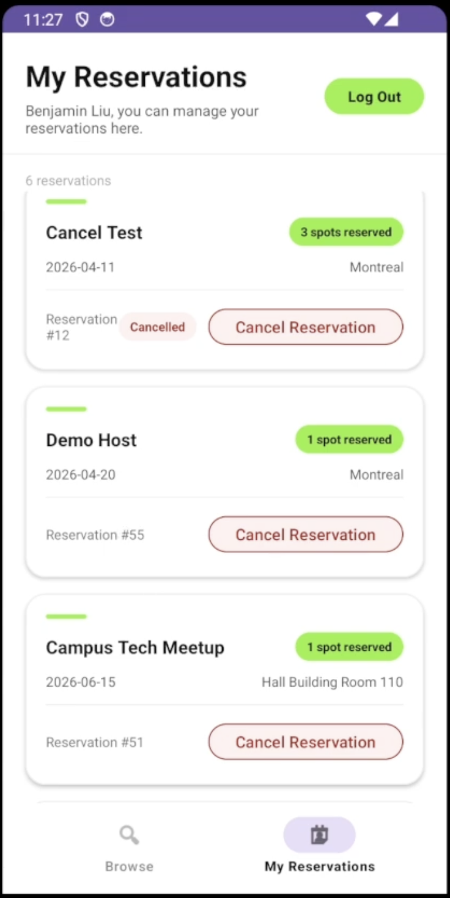

# SpareSeat — Ticket Reservation App

> *Book it. Show up. Enjoy.*

SpareSeat is an Android app backed by a Spring Boot REST API that lets users browse events, reserve spots, and manage their bookings — all from their phone. Admins can create, update, and cancel events through the same backend.

## Screenshots

<table>
  <tr>
    <td align="center"><br/><sub>Splash Screen</sub></td>
    <td align="center"><br/><sub>Browse Events</sub></td>
    <td align="center"><br/><sub>Event Details & Reserve</sub></td>
    <td align="center"><br/><sub>My Reservations</sub></td>
  </tr>
</table>

## Features

- Browse and search events by title or location
- Filter by date, category, and location
- Reserve one or more spots at an event
- Email confirmation sent on successful booking
- Cancel reservations from the My Reservations screen
- Admin support for creating and managing events

## Team

| Name | Student ID |
|---|---|
| Benjamin Liu | 40280899 |
| Jordan Yeh | 40283075 |
| Gregory Sacciadis | 40207512 |
| Hendrik Tebeng | 40282196 |
| Akshey Visuvalingam | 40270505 |

## Setup

### Backend (Spring Boot)

**Requirements:** Java 17+, Maven (wrapper included)

The backend uses PostgreSQL (Supabase) and Gmail SMTP. Create a `.env` file in the `backend/` folder:

```env
SPRING_DATASOURCE_URL=jdbc:postgresql://your-host:5432/your-db?sslmode=require
SPRING_DATASOURCE_USERNAME=your-db-username
SPRING_DATASOURCE_PASSWORD=your-db-password
SPRING_MAIL_USERNAME=your-email@gmail.com
SPRING_MAIL_PASSWORD=your-gmail-app-password
```

Run the backend:

```bash
# macOS / Linux
cd backend && ./mvnw spring-boot:run

# Windows
cd backend && .\mvnw spring-boot:run
```

### Frontend (Android)

**Requirements:** Android Studio, JDK 11+, Gradle (wrapper included)

- Open the `client/` folder in Android Studio
- Build and run using the Gradle wrapper or Android Studio's run button
- Min SDK: 24 · Target SDK: 36

## E2E Tests (Maestro)

Install Maestro: https://docs.maestro.dev/get-started/quickstart

**Prerequisites:** Android emulator running (or device connected via ADB) with the backend reachable from the device.

```bash
maestro test .\.maestro\
```
